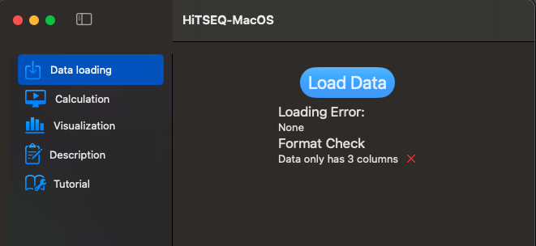
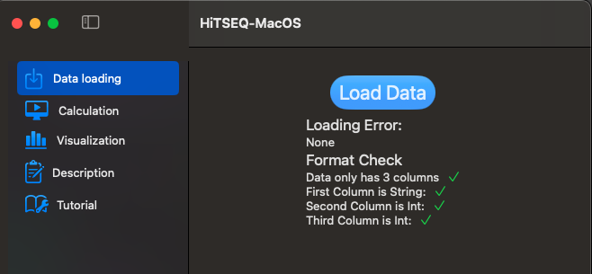
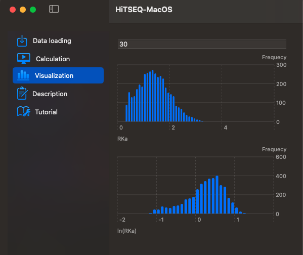

# HiTSEQ for macOS

There is no need to install Python or R, just use your mac and HiTSEQ-MacOS can give you thousands of affinities in seconds with data visualization. Easy to use.

## System Requirement
macOS 14.0 (Sonoma)

## Input data format
1. Your csv file does **NOT** have headers.
2. There are **3** columns in your csv file.
3. The first column is for random sequence varients. Usually it contains sequences with 6 to 7 nucleotides.
4. The second column is for your control point without any binding performed. **Just your random library**.
5. The third column is for your **binding point**.
6. The data type for each column is [String, Integer, Integer]
7. For each row, your data may look like:

| AAAAAA | 4329 | 2343 |
|--------|------|------|
|AAAAAC|3452|1342|
|AAAAAG|2353|2342|

or 

 AAAAAAA | 439 | 233 |
|--------|------|------|
|AAAAAAC|345|134|
|AAAAAAG|233|232|

There is a sample input data for your convenience.

There is also a demo data in this app tutorial part for you to play around.

## How to use
### Load data
Data loading function will load your csv file and check the format for you.

### Calculation
Now we can go to **Calculation** function.
Just follow steps 1 to 5 and you will get your results.
#### Parameters
- Enzyme Concentration: It is the concentration of your enzyme/protein/RNA/DNA etc. when you perform the binding experiment for the second column.
- Referece Sequence: The sequence varient you usually use for normalize/compare your results.
- Filter count: When performing sample preparation, there might be issues which cause the sequences can not be amplified well. Those issues may include RT, PCR, or anything. Setting this threshold can help you mark sequences with low reads. Even though the app still calculate and export all sequence varients for you, you can filter them out by the N or Y mark in Excel or any tool.

There will be a column indicate N or Y. **N** means the reads of the sequence varient in the first column is less than the threshold.

### Visualization

Here two histograms are provided for observe data distribution. The difference is the x axis. One is Relative Rate Constant (RKa) and another one is log(RKa).The Y axis is Frequency (sequence count).

### Description

The top 10 sequences and 10 sequences with lowest RKa will be shown here.

### Tutorial

A sample dataset is provided for your convenince. Just click **Load sample data** and **Calculate** to see what will happen.
